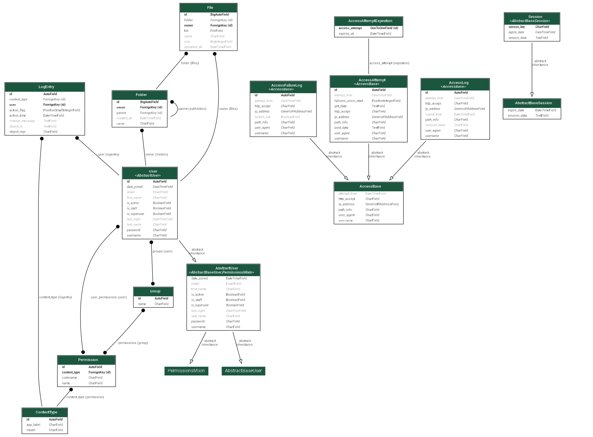

<div align="center">
    <h1>FileSpace</h1>
    <p>Simple personal file storage.<br>Written in Python/Django</p>
    
</div>

## Features

- [X] Upload **single files**, **multiple files** or entire **folders**
- [X] **Download files** with original filenames preserved
- [X] **Recursive folder downloads** as `.zip` archives
- [X] Unlimited **nested folder hierarchy** support
- [X] File and folder **search**
- [X] Recursive file and folder **deletion**
- [X] Secure user authentication and isolated **per user file storage**
- [X] **UUID based** secure file storage
- [X] Brute force login protection with **rate limiting**

## Database Schema



## Usage

### Local Development

First install `uv` and sync the project dependencies:

```bash
cd path/to/root/directory
pip install uv
uv sync
```

Migrate database:

```bash
uv run manage.py migrate
```

Run Django server:

```bash
uv run manage.py runserver
```

Access web application at `http://127.0.0.1:8000` or `http://localhost:8000`.

### Production Deployment (Docker)

Set up your environment variables:

```bash
cp .env.prod .env
nano .env  # modify file, instructions inside
```

Build and start the container in the background:

```bash
docker compose up -d --build
```

Access web application at `http://127.0.0.1:8001` or `http://localhost:8001`.

## Demo Images


